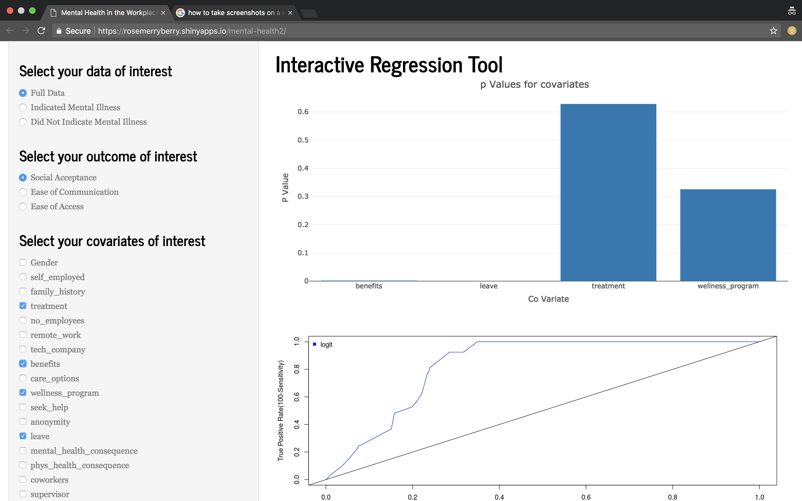

```{r setup, include=FALSE}
knitr::opts_chunk$set(echo = TRUE)
library(plotly)
library(knitr)
data <- read.csv("./project/data/clean_data.csv")
source('./project/regressionFunctionsForShiny.R')
source('./project/CovariateExplanations.R')
source('./project/bestfit.R')
```

##Abstract
This paper details the strategy our group took to solve the question of what factors most influence the social acceptance of mental health in the work place, and suggestions we can make based on those findings. We developed three metrics to evaluate this question - social acceptance, ease of communication, and ease of access. We used logarithmic regression to evaluate the significance of different combinations of covariates for each outcome. We build an interactive tool where you could build a model, see the p values of each covariate, and assess the of fit of the model. Ultimately we can conclude that having open conversations about mental health in the abstract, allowing those who are suffering from it to remain anonymous if they choose, and allowing for leave to be taken to recover from mental illness are going to have the most impact in increasing the social acceptance of mental health.

##Introduction

The problem space we are exploring in this paper is the significance of the social acceptance of mental health, and how that interacts with measures like ease of communication about mental health and ease of access to resources about mental health. This is significant because in a given year, typically one in five people in the USA alone will suffer from mental illness (Mental Health By The Numbers). It is an extremely prevalent form of human suffering that carries a much higher stigma than physically apparent injuries and illnesses, such as broken bones or cancer. As such, society in the USA is much less inclined to give those suffering from a mental illness the sort of leeway and understanding for recovery that they would for physical illnesses. This is apparent in insurance claims, company policies on leave, and even an employee's direct supervisor's policy. The purpose of this exploration is to use the data we found to identify signifcant factors of work life that impact the social acceptance, ease of access and ease of communication that one experiences in the work place, and then take those factors to make concrete recommendations that employers can use to make their offices more accessible to those with mental illness. This is the specific question of interest that we explored:  

####To what extent do different facets of interactions about mental health in the office contribute to the social acceptance of mental health?

The data in this analysis comes from a survey conducted by Open Sourcing Mental Illness (OSMI) a non profit corporation dedicated to raising awareness, educating, and providing resources to support mental wellness in the tech and open source communities. They do a survey annually, and we are using the 2014 survey for this project. The survey contained demographic information about the participant, and the answers to their questions from the survey. 

##Related Work - A description of previous papers or projects related to your project.

The study and impact of mental health awareness has been particularly prevalent in recent years. Researchers have found it interesting to study the associations between common mental disorders and workplace productivity. "Mental health and the workplace: issues for developing countries" (Chopra) is a paper that highlights the necessity of providing mental health benefits and leniency of time off/leave for those suffering from mental health illness in developing countries. While the USA and other developed countries have been working to better address mental health concerns, developing countries are still learning how to motivate and encourage their employees to be comfortable enough to talk about mental health conditions that are increasingly common in today's globalized and high-pressure environments. Further, supporting research highlighted in the paper (Chopra) suggests that "the odds of absenteeism due to health reasons [are] twice as high for employees with depressive symptoms." Therefore, it is important to highlight the direct and inverse correlation of employee well-being to the ability/productivity to work. 

Other papers, like "The "Work" of the Workplace Mental Health" (Malachowski) have studied and investigated the impact of mental health on productivity in the workplace. An ethnographic study based in Ontario, looked at employees work of managing and negotiating episodes of depression, managers administrative work of maintaining privacy and confidentiality, and the administrative work of authorizing illness. The lack of awareness and inadequate training provided to managers to support mental health is one of the reasons why many workplaces fail to establish a socially acceptable and open illness culture. Malachowski summarizes advocacy efforts to facilitate organization and policy changes to enhance services and support for employees in the workplace.

These works have helped us understand the direction that researchers are going for when they look at mental illness awarness in the workplace and the adverse affects it has in the absence of it. Our research also folllows a similarly trajectory where we explore the factors involved in creating environments that are not only socially acceptable of mental illness but also providing and supporting the open dialogue of mental illness and the resources necessary to cope appropriately.  

##Methods - A detailed explanation of the techniques and algorithms you used to solve the problem.

###Data Cleaning
When we originally procured the data, the first thing we did was trim responses out to just the ones we needed. There was an area for comments by the respondant that we removed, and we also removed country and state level data because of the large number of non responses. We had hoped to continue using age as a covaritate, but there were also a large number of non responses as well as responses that didn't make sense (extremely high numbers, negative values, and extremely small numbers).

We then went about encoding all of the remaining responses into numeric values. We did this so we could easily calculate our outcomes of interest and run regressions of the data (Figure 1).

We also decided to coerce some responses. These desicions were context based, for example, there were NA responses to the 'Are you self employed?' question. Because there were only about 10 non responses, we determined that these respondants were NOT self employed, because they indicated working at large companies in the 'How many employees does your company have?' question. Some questions, for example, 'Has your employer ever discussed mental health as part of an employee wellness program?' had the responses of 'yes', 'no', and 'don't know'. Due to the nature of the question, we were able to encode the 'dont' know' responses as 'no' responses, because if you had never experienced a mental health dicussion then your response could equally be no or don't know.

Finally, we were able to split our original dataset into two subsets for exploration. One of the questions in the survey that stood out to us was 'If you have a mental illness, to what extent would you say it has interfered with your work?' We found this interesting because no where in the survey does it ask directly if a participant has a mental illness, but this question is prety revealing. If one answered it, they likely had a mental illness, and this allowed us to split the set into those who were suffering from mental illness and those who were not.

###Calculating the Outcomes of Interest

We calculated a binary outcome to represent the social acceptance, ease of communication, and ease of acccess for mental health in the workplace (See Figure 2). If a response contained certain responses that it was categorized as having the outcome, and if it failed on any one of the responses we were looking at, it was categorized as not having that outcome. This simple approach was taken in order to allow us to consider all three outcomes without using wildly different methods of arriving at those outcomes, so we could compare our results of those models.

###The Model

For this project we decided to do a log regression on several combinations of covariates for each outcome of interest, using the full dataset as our background for data. We decided not to use the subsets of having a mental illness vs not having a mental illness because our recommendatoins shoudl work for all employees, because those who do not have an illness now might develop one later, and those suffering now may not need the resources forever. For this analysis it was not critical for us to select a p value threshold because we were looking at the effects of both singular covariates as well as combinations, but we did generally tend towards values below 0.05. In addition to examining the relative values of the p values we also checked the goodness of fit of the model on an ROC curve. Our final model choices were based on a combination of contextual choices (what covariates intuitively work well together), the goodness of fit of the ROC curve, and then the resulting p values from the model.

###The Technique

As stated previously, our final models of choice relied on several factors, including context. This meant that instead of streamlining the process of finding the lowest p value combinations/best ROC curve fit for each outcome of interest by writing a program to do it, we decided to work through combinations by hand and consider the implications of each. For example, gender seemed to have a large influence on the outcome of interest, but we couldn't very well suggest that each office become entirely female. Our goal was to provide concrete recommendations based on the data, and for us that required taking context into consideration for each covariate. This meant that we developed a tool to explore the data, the p values and the goodness of fit of the model. You can see a screenshot of the tool in Figure 3, and look at the site [here](https://rosemerryberry.shinyapps.io/mental-health2/). 

##Results - The major insights resulting from your research.

The following results are the covariates of interest that we found for each outcome considered in this paper. Their respective charts can be found in the appendix.

###Ease of Communication

Family_history, leave, and seek_help have the biggest effect on our outcome of interest, ease of communication. The p-values for these covariates range from essentially 0 to 389mu, which is also essentially 0 (Figure 4.1). This shows a very strong correlation (Figure 4.2). After finding these covariates of interest, we are able to speculate about why they have an effect on ease of communication. The questions asked were "Do you have a family history of mental illness?", "How easy is it for you to take medical leave for a mental health condition?", and "Does your employer provide resources to learn more about mental health issues and how to seek help?". These questions seem to be fairly intuitive in the relation to ease of communication - perhaps because the subject has family history of mental health ilness, they know of resoures and feel more comfortable discussing the fact. Additionally, if an employer provides mental health resources and it is easy to take medical leave because of a mental health condition, the subject may become more common and less personal in the workplace, allowing the subject to talk freely about mental health.

###Ease of Access

Treatment, no_employee, and anonymity have the biggest effect on our outcome of interest, ease of access to mental health care. The p-values for these covariates range from essentially 0 to 0.027 (Figure 5.1), which show a strong correlation (Figure 5.1). The questions asked were "Have you sought treatment for a mental health condition?", "How many employees does your company or organization have?", and "Is your anonymity protected if you choose to take advantage of mental health or substance abuse treatment resources?". Some of these questions intuitivly make sense immediately - anonymity provides privacy and so subjects may feel safer to access mental health care. If the subject has already sought treatment for a mental health condition, they will be more familiar with attaining the help they desire. Number of employees seems the least related to accessing mental health care, but perhaps in a large company, the subject knows more people who have used mental health services and then better understands the opportunities to gain access to mental health care. On the other hand, if the subject works at a small company, they may be closer with the other employees and have a more diverse dialogue that includes the subject of mental health.

###Social Acceptance

Coworkers, leave, supervisor, and obs_consequence have the biggest effect on our outcome of interest, social acceptance of mental health care. The p-values for these covariates range from essentially 0 to 0.98 (observed consequence) (Figure 6.1, Figure 6.2). This is an extremely high p-value, but it is important to notice that when the observed consequence is selected as a covariate, the other covariate's p-values decrease significantly - the next highest is coworkers at 0.48. It is likely so high because we used it in our calculation of social acceptance. The questions asked were "Would you be willing to discuss a mental health issue with your coworkers?", "How easy is it for you to take medical leave for a mental health condition?", "Would you be willing to discuss a mental health issue with your direct supervisor(s)?" and "Have you heard of or observed negative consequences for coworkers with mental health conditions in your workplace?". The covariates of coworker and supervisor are very relevent to this outcome because they represent the social aspect of the office. Leave plays a role because the coworkers are willing to fill in for the work you are missing because they understand and accept the needs of mental health conditions. Observed consequence is relevent because it also has to do with the social aspect of the work environment.

##Discussion - What are the implications of your results?

[[[[[request for editing - please remove redundant covariate/question the covariate represents that is in both results and discussion]]]]]

In our 'Ease of Communication' analysis, we found that three covariates `family_history`, `leave`, and `seek_help` had the greatest effect on our outcome of interest. `seek_help` is the most obvious outcome, where subjects answered, 'Does your employer provide resources to learn more about mental health issues and how to seek help?'. Perhaps more interesting was the the correlation between ease of communication and the covariate `family history`, which asks, 'Do you have a family history of mental illness?' In other words, if an employee has a family history of mental illness, they are likelier to find that communicating mental illness is substantially easier. While it is obviously not possible to suggest that employee's should have a family history of mental illness just to improve their ease of communication, we can potentially devise other ways to link these covariates. While providing resources that address mental illnesses and as well as employee health leave are appropriate reponses, we suggest a hybrid of help resources and family mental illness history changes. Specifically, the employer could introduce material that introduces information about family mental illness history and awareness could prove effective in easing the communication of said illnesses. Digital media, documentation, and other sources suggesting employees look into family health history combined with strategica resources for those seeking mental illness help would be an example of this workplace improvement. Ultimately, this solution can be thought of as a combination of covariates that not only informs employees but also provides awareness of family mental health history and acceptance.

When analyzing our covariates for 'Ease of Access', we found that `treatment`, `no_employee` and `anonymity` have the biggest effect. Anonymity had a surprisingly large effect on the outcome of interest and we surmise that because employees have anonymity, they might find it more comfortable or even safer to access mental health care resources. Additionally, an increase in company size also correlates to ease of access - presumably because with more employees, the chance of others knowing about the employees mental health illness decreases. We are led to believe that there is a stigma in the workplace against illness - specifically mental illness. While we could suggest the implementation of measures to anonymize employee requests for mental health illness resources, it still would not solve the problem for companies with a small number of employees (eg. less than 20). Therefore, our recommendation is for companies to not only anonymize the process of seeking access to mental health care and substance abuse treatment, but also to delegate the response to a third-party, like human resources. Many very small companies often utilize a third-party HR resource, which could offer employees an anonymous experience but also simulate a large company because there is less personal health discolsure between HR and other members of the company.

Finally, our last recommendation for improving workplace mental health is concerned with the outcome of interest, 'Social Acceptance'. We found that the covariates, `coworkers`, `supervisor`, `leave`, and `obs_consequence` has the greatest effects. While the first two recommendations above would potentially provide improvements in this outcome of interest as well, we are more concerned with the social impacts of having a mental illness in the workplace. Therefore, we recommend that employers encourage employees to take leave to tend to their mental health illness and promote communication between the coworkers and supervisors about mental health conditions in order to normalize the dialogue about mental health conditions.Coupled with a policy of anonymization and the third-party approval system outlined in recommendation two, this would have significant positive impacts on social acceptance of mental health illness in the workplace.

##Future Work - A description of how your system could be extended.

Our system of exploratory analysis, using survey data and calculated outcomes, has implications for statisical analysis beyond it's application in this realm. The scaffolding we have developed can be added upon to include models beyond log regression, use data and covariates independent of mental health, to give people agency in quickly discovering statistically significant facets of their dataset. The more flexible the tool, the more possible uses, and given the chance to extend it, that is where we would go, and then take our tool and evalgelize it as a way for students and professionals to quickly and easily get a baseline understanding of what features of their dataset warrent further investigation.

In the realm of mental health, our research would best be extended by reexamining workplaces that have taken the steps we recommended. Social engineering the acceptance of mental health is far more complicated and unpredictable that what we have touched on here, and as we have discussed requires context and careful considerating of the implications of your recommendations. So to extend what we have done here, we would have to iterate on our recommendations, based on if they worked or not, and see what interplay other facets of the workplace have on our intended outcomes.

As a whole, we do believe our recommendations come from a data driven analysis and should most certainly be considered by institutions looking to increase the quality of work/life for their employees, regardless of if they are suffering from a mental illness at this current moment. In a world where invisible suffering can so easily be ignored, research like this plays an important role in making significant strides towards quantifying what was once considered delusions that could not be represented in the physical world. We hope our recommendations help in the goal of reducing human suffering and increase the access to care that everyone needs to stay healthy.

##Works Cited

Chopra, Prem. ???Mental Health and the Workplace: Issues for Developing Countries.??? International Journal of Mental Health Systems 3 (2009): 4. PMC. Web. 11 Mar. 2018.

Malachowski, Cindy K., et al. ???The ???Work??? of Workplace Mental Health.??? Society and Mental Health, vol. 6, no. 3, 2016, pp. 207???222., doi:10.1177/2156869316642265.

"Mental Health By The Numbers." NAMI: National Alliance on Mental Illness, National Alliance on Mental Illness, www.nami.org/learn-more/mental-health-by-the-numbers.   


##Appendix

###Figure 1

```{r echo=FALSE}
kable(getCovariateDefinitions() %>% select(-definitions))
```

###Figure 2

####Ease of Communication
*IF*      
benefits == 1 &   
care_options == 1 &   
wellness_program == 1 &   
seek_help == 1   
*THEN*     
ease of communication is TRUE   

####Ease of Access
*IF*   
supervisor > 1 &   
mental_health_interview = 1 OR phys_health_interview = 2 &   
mental_health_consequence = 1 OR cphys_health_consequence = 2   
*THEN*   
ease of access is TRUE

####Social Acceptance
*IF*   
benefits == 1 &   
care_options == 1 &   
wellness_program == 1 &   
seek_help == 1   
*THEN*   
ease of communication is TRUE
                
###Figure 3


###Figure 4.1
```{r echo=FALSE}
dataFrame <- data
covariates <- c('family_history', 'leave', 'seek_help')
outcome <- 'obs_consequence'
    
pVals <- getPVals(dataFrame, covariates, outcome)

createHistogram(pVals)
```

###Figure 4.2
```{r echo=FALSE}
dataFrame <- data
covariates <- c('family_history', 'leave', 'seek_help')
outcome <- 'obs_consequence'

model <- create_glm_model(covariates, dataFrame, outcome)

p <- draw_best_fit(model, covariates, dataFrame, outcome)
```

###Figure 5.1
```{r echo=FALSE}
dataFrame <- data
covariates <- c('treatment', 'no_employees', 'anonymity')
outcome <- 'care_accessibility'
    
pVals <- getPVals(dataFrame, covariates, outcome)
    
createHistogram(pVals)
```

###Figure 5.2
```{r echo=FALSE}
dataFrame <- data
covariates <- c('treatment', 'no_employees', 'anonymity')
outcome <- 'care_accessibility'

model <- create_glm_model(covariates, dataFrame, outcome)

p <- draw_best_fit(model, covariates, dataFrame, outcome)
```

###Figure 6.1
```{r echo=FALSE}
dataFrame <- data
covariates <- c('leave', "obs_consequence", "coworkers", "supervisor")
outcome <- 'social_acceptance'
    
pVals <- getPVals(dataFrame, covariates, outcome)
    
createHistogram(pVals)
```

###Figure 6.2
```{r echo=FALSE}
dataFrame <- data
covariates <- c('leave', "obs_consequence", "coworkers", "supervisor")
outcome <- 'social_acceptance'

model <- create_glm_model(covariates, dataFrame, outcome)

p <- draw_best_fit(model, covariates, dataFrame, outcome)
```